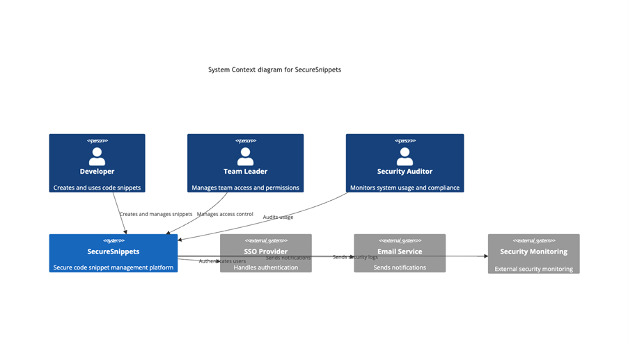
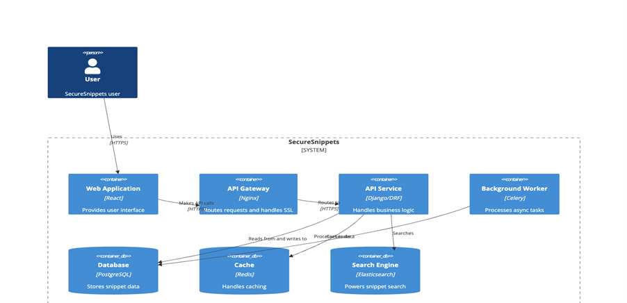
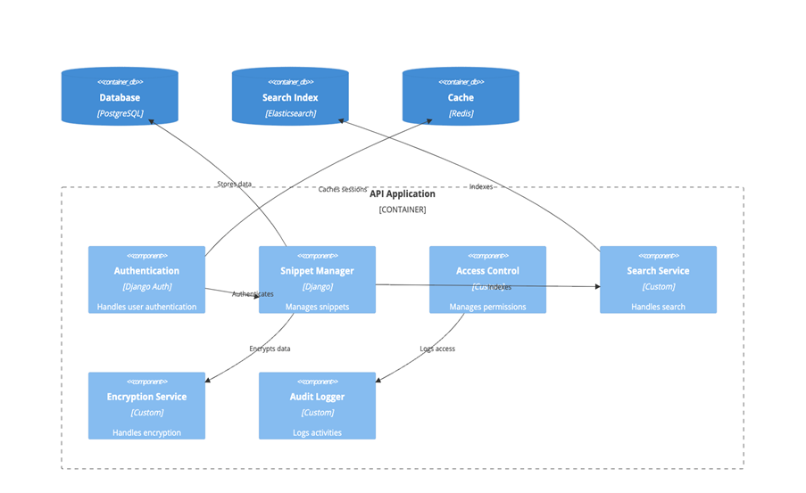
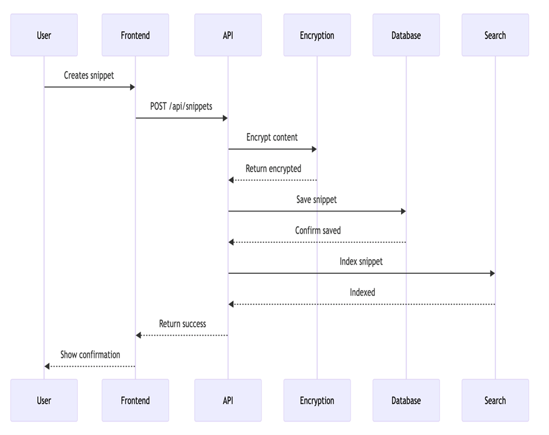
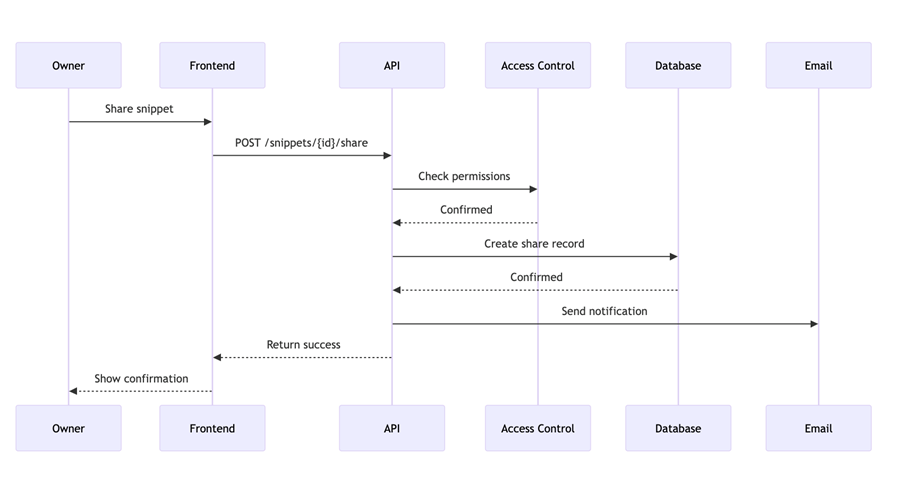
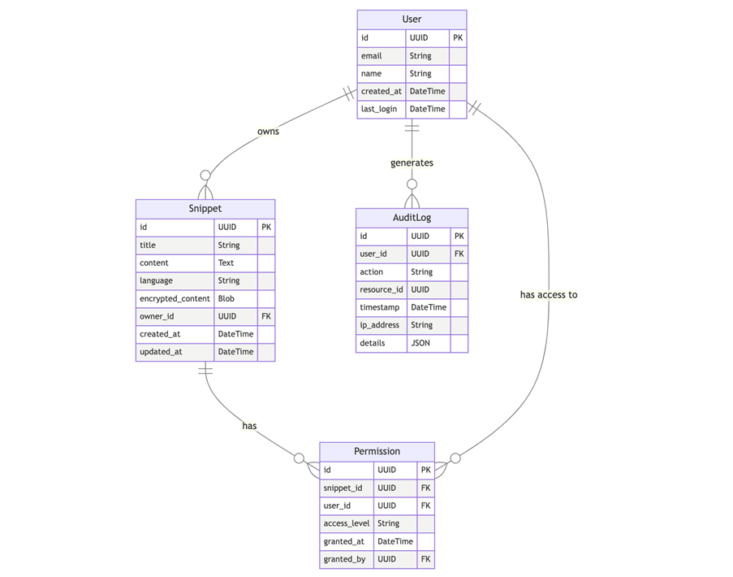
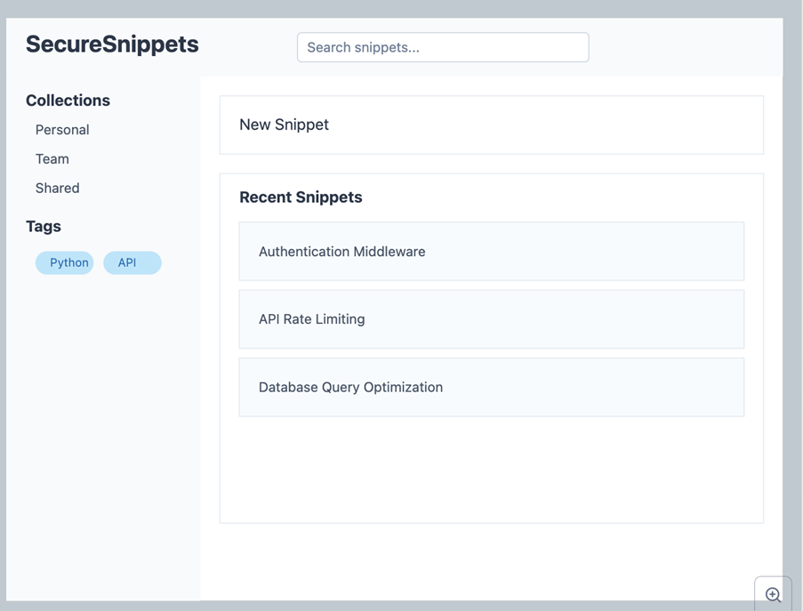
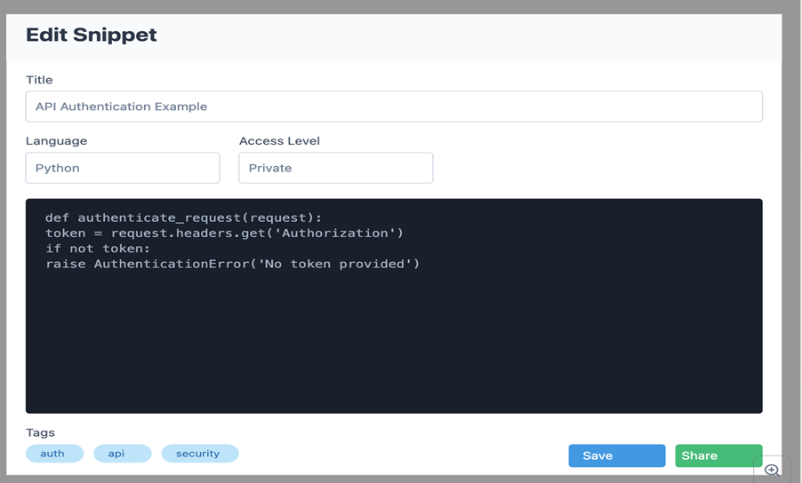
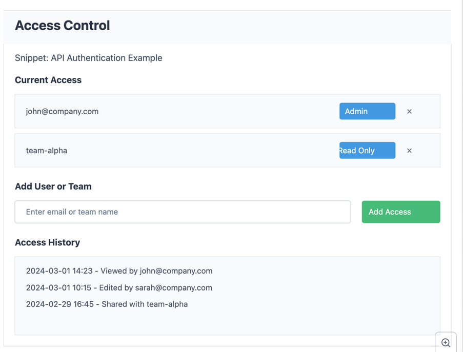

**SecureSnippets**

**Executive Summary**

SecureSnippets revolutionizes how developers manage and share code snippets within organizations. In today's software development landscape, developers frequently reuse code fragments, but existing solutions often lack proper security controls and audit capabilities. SecureSnippets addresses this gap by providing enterprise-grade security features while maintaining the ease-of-use developers expect.

The platform encrypts all stored snippets, enforces granular access controls, and maintains comprehensive audit logs - making it perfect for teams handling sensitive codebases. With features like syntax highlighting, powerful search, and seamless sharing, SecureSnippets helps development teams maintain their snippet library securely and efficiently.

**Installation**

bash

Copy

_\# Clone the repository_

git clone <https://github.com/yourusername/securesnippets.git>

_\# Navigate to project directory_

cd securesnippets

_\# Build Docker containers_

docker-compose build

_\# Start services_

docker-compose up -d

_\# Run migrations_

docker-compose exec web python manage.py migrate

_\# Create admin user_

docker-compose exec web python manage.py createsuperuser

**Getting Started**

1. Access the web interface at <http://localhost:8000>
2. Log in with your administrator credentials
3. Create your first snippet collection
4. Add snippets and configure sharing permissions
5. Invite team members to collaborate

For detailed usage instructions, see the in-app documentation or visit our [user guide](file:///Users/myeredla/Library/Containers/com.microsoft.Word/Data/Library/Preferences/AutoRecovery/docs/USER_GUIDE.md).

**Documentation**

**User Stories**

**Core User Stories**

1. As a **developer**, I want to **securely store my code snippets** so I can **reuse them across projects without compromising security**.
    - Acceptance Criteria:
        - Snippets are encrypted at rest
        - Support for multiple programming languages
        - Syntax highlighting
        - Tags and categorization
        - Version history
2. As a **team leader**, I want to **manage snippet access permissions** so I can **control who can view and edit sensitive code**.
    - Acceptance Criteria:
        - Granular permission settings (read/write/admin)
        - Bulk permission management
        - Access audit trail
        - Revocation capabilities
        - Sharing notifications
3. As a **security auditor**, I want to **monitor snippet usage and access patterns** so I can **ensure compliance with security policies**.
    - Acceptance Criteria:
        - Comprehensive audit logs
        - Access attempt tracking
        - Usage analytics
        - Exportable reports
        - Real-time alerts

**Mis-user Stories**

1. As a **malicious insider**, I want to **exfiltrate all stored code snippets** so I can **steal intellectual property**.
    - Mitigation Criteria:
        - Rate limiting on API endpoints
        - Automated detection of bulk downloads
        - Access pattern analysis
        - Data loss prevention controls
        - Watermarking of downloaded content
2. As an **unauthorized user**, I want to **bypass access controls** so I can **access restricted snippets**.
    - Mitigation Criteria:
        - Strong authentication requirements
        - Session management
        - IP-based access controls
        - Failed attempt monitoring
        - Regular security audits
3. As an **attacker**, I want to **inject malicious code into snippets** so I can **compromise systems using them**.
    - Mitigation Criteria:
        - Input validation
        - Content security policies
        - Code execution prevention
        - Version control
        - Malicious pattern detection

**2\. Architecture Documentation**

**2.1 Context Diagram**

**2.2 Container Diagram**

**2.3 Component Diagram**

**2.4 Create Snippet Sequence**

**2.5 Share Snippet Sequence**

**2.6 Data Model**

**UI Mock-ups**

**Dashboard View**

**Snippet Editor**

**Access Control Panel**
